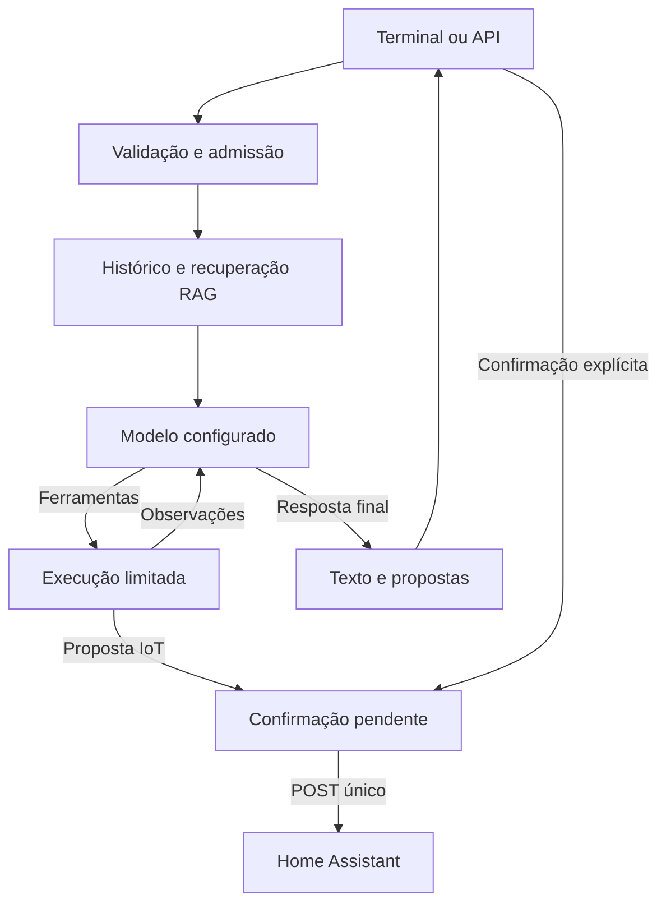

# Arquitetura e operação

## Escopo

Assistente local para um proprietário. Orientação a objetos separa provedores, memória, ferramentas e interfaces. A API compartilha o mesmo núcleo da CLI. O sistema depende de um LLM com chamadas de ferramentas; o suporte a três provedores não torna todos os modelos intercambiáveis em qualidade ou desempenho.

## Ciclo de áudio

O microfone coleta frames mono de 100 ms. Uma janela inicial preserva o começo da fala; energia RMS detecta início e silêncio detecta término. Há limites de espera e duração. Whisper transcreve a frase completa em um worker dedicado. O texto passa ao agente; a resposta textual aparece antes de síntese e reprodução. A captura é pausada até o fim da reprodução. Não há streaming de transcrição, barge-in, cancelamento acústico de eco ou palavra de ativação. Esses recursos exigem um pipeline de áudio adicional e avaliação em ambiente real.

## Grafo e contexto

O grafo alterna nós de modelo e ferramentas. Há limites de rodadas, chamadas por rodada, resposta das ferramentas, tokens gerados, texto de entrada e duração. Após o orçamento de ferramentas, a última chamada usa o modelo sem ferramentas. As mensagens de ferramenta existem apenas durante a rodada corrente; o buffer retém pares completos de texto humano/assistente, evitando históricos com tool calls órfãs. Limites por caracteres não são contagem exata de tokens: ajuste `HISTORY_CHARS`, `LLM_MAX_TOKENS` e o contexto do modelo em conjunto.

O buffer usa LRU, TTL e identificação `(owner, session)`. Não persiste após reinício. As preferências exigem gravação explícita e são recuperadas por embeddings locais com filtro por `owner`. O Singleton fornece apenas um cliente Chroma por processo. A alteração do modelo de embeddings cria uma coleção nova. `/forget` remove preferências de todas as coleções do aplicativo para aquele proprietário. Exclusão lógica no Chroma/cache não equivale a apagamento forense de backups ou páginas livres do disco.

## Concorrência e falhas

O núcleo admite uma resposta por vez e rejeita solicitações simultâneas rapidamente com 429. O HTTP mantém conexões reutilizáveis, não segue redirects e repete somente GET em falha de rede, uma vez. POST de automação e síntese premium não é repetido automaticamente. Workers bloqueantes têm uma vaga: cancelar a coroutine não libera essa vaga até a tarefa nativa terminar. Isso evita acumular transcrições ou embeddings após timeouts.

Python não consegue interromper à força uma operação nativa já iniciada em thread. No encerramento, a aplicação espera esses trabalhos terminarem; um driver de áudio bloqueado ou inferência travada pode atrasar o shutdown. Para isolamento rígido, mova inferência e captura a subprocessos supervisionados. O fechamento do runtime ocorre em ordem inversa à inicialização, inclusive quando a inicialização falha parcialmente.

Memória indisponível durante recuperação gera um aviso e permite resposta sem RAG. Falha de inicialização da memória é explícita; use `MEMORY_ENABLED=false` para operar sem ela. TTS indisponível preserva o texto. Configurações e exceções não exibem valores secretos nos logs próprios. Bibliotecas externas podem ter sua própria telemetria; Chroma recebe `anonymized_telemetry=False`, e tracing externo não é habilitado pelo aplicativo.

## Autorizações

URLs, serviços, entidades e webhook IDs vêm de configuração confiável. O modelo pode escolher apenas um alias permitido para propor. A proposta gera token aleatório, expira e fica vinculada a usuário e sessão. A confirmação é recebida exclusivamente por comando digitado ou endpoint autenticado. O token é consumido antes do POST; falhas após envio são resultados incertos. Isso evita repetição involuntária, mas não é uma garantia distribuída de exactly-once. Não existe verificação física de estado, transação com dispositivos ou rollback de automações.

A API usa um token de proprietário, limite de corpo e timeout de upload; não implementa cadastro, RBAC ou tenancy. `/health` confirma apenas conclusão do startup. Preferências, conversas e TTS podem ser enviados ao provedor configurado; escolher Ollama não torna Edge-TTS offline. Busca e clima também usam a internet.

## Evolução de escala

Não inicie vários workers escrevendo no mesmo diretório Chroma embutido. Para atender múltiplos usuários ou instâncias, externalize Chroma para um servidor, o histórico e as confirmações para um armazenamento com operações atômicas e TTL, e a admissão para um limitador distribuído. Use identidade derivada da autenticação de cada usuário, não fornecida no corpo da requisição. Separe o cliente de áudio do backend e mantenha inferência em workers dimensionados pela memória disponível. Essas mudanças são necessárias antes de escalar horizontalmente; não estão implementadas nesta versão local.

## Validação no destino

1. Instalar dependências em ambiente limpo e executar `pip check` e a suíte.
2. Testar texto com o modelo escolhido e confirmar chamada real de hora e busca.
3. Gravar frase curta, silêncio, ruído e fala longa no microfone real.
4. Verificar os dois provedores TTS disponíveis na sua conta/rede e o reaproveitamento do cache.
5. Salvar preferência, reiniciar e verificar RAG; apagar e confirmar a exclusão lógica.
6. Configurar inicialmente uma ação reversível, observar que a proposta não executa e confirmar manualmente.
7. Simular perda de rede e verificar resultado incerto sem reenvio automático.
8. Medir tempo por etapa no seu hardware antes de estabelecer SLOs.
