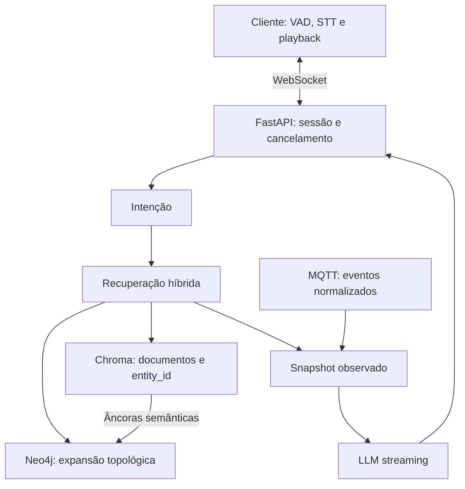

# Núcleo híbrido — referência arquitetural executável

Esta extensão é um serviço independente de referência em `examples/hybrid`. Não altera o ponto de entrada `app.main` da versão anterior. Seu objetivo é demonstrar GraphRAG, assinatura de estados MQTT e tokens por WebSocket. O WebSocket é bidirecional; a captura de áudio/VAD contínuo e TTS full-duplex exigem a integração de cliente descrita abaixo.

## Design



O grafo possui nós `intent`, `retrieve`, `live_state` e `answer`. Cumprimentos evitam recuperação. Consultas semânticas usam Chroma. Consultas topológicas ou de estado recuperam âncoras `entity_id` e expandem a vizinhança com Cypher fixo. Quando já há IDs explícitos, as consultas vetorial e topológica acontecem em paralelo. Quando os IDs vêm da busca semântica, a expansão depende dela e ocorre depois. Nenhum Cypher livre é gerado pelo modelo.

`HybridState` reúne `vector_context`, `graph_context`, `device_context`, intenção, identidade e avisos. O grafo é compilado uma vez no lifespan e pode executar estados de turnos independentes. Esta referência não adiciona checkpoint persistente nem histórico ao novo endpoint; a migração do buffer anterior é uma etapa separada. O roteador heurístico é rápido, mas limitado: meça classificação e substitua por classificador local treinado ou saída estruturada quando necessário.

Chroma armazena texto e IDs de entidades; Neo4j armazena relacionamentos cadastrados; MQTT alimenta estado observado com timestamp e freshness. Telemetria não é inserida no prompt a cada evento nem gera chamadas automáticas ao LLM. O contexto é um snapshot do momento da recuperação; eventos posteriores chegam separadamente ao cliente. Documentos não são fonte autoritativa para estado atual do hardware.

## Tuya e modelagem elétrica

Os arquivos `cypher/schema.cypher` e `cypher/example.cypher` modelam quadro, circuito, dispositivo e ambiente. A relação `MONITORED_BY` não presume que o equipamento ofereça proteção certificada. `protection_verified=false` explicita a ausência dessa verificação. Os exemplos são fictícios e não prescrevem dimensionamento ou ligação elétrica.

Dispositivo Tuya Wi-Fi não implica suporte a MQTT local. A integração oficial Tuya do Home Assistant é classificada como Cloud Push; nem todas as funções do SmartLife são expostas. Use uma ponte compatível com o dispositivo, como um processo que assina `state_changed` do Home Assistant e publica eventos normalizados no broker. A ponte deve emitir observações atuais/indisponibilidade e sincronizar relógio. Não atribua latência local ao trecho que ainda depende da nuvem Tuya.

Formato de tópico e payload:

```text
jarvis/casa01/devices/tuya_qd01_c03/state
```

```json
{
  "event_id": "5d3a3c54-0494-4c11-96f6-d3941c51a4e8",
  "device_id": "tuya_qd01_c03",
  "state": "on",
  "observed_at": "2026-09-06T12:00:00Z"
}
```

O `event_id` deve ser único por observação. QoS 1 entrega pelo menos uma vez, não exatamente uma vez. O cache rejeita duplicatas e observações fora de ordem por dispositivo. Timestamps requerem relógios sincronizados; mensagens com o mesmo timestamp são descartadas, portanto a ponte deve produzir instantes distintos para mudanças distintas. `observed_at` deve representar observação real, não apenas republicação do último estado salvo. Publish retido não rejuvenesce observações antigas.

TTL e perda da conexão marcam estados como stale. A ponte deve republicar observações verificadas antes do TTL ou usar `unavailable` quando perde acesso ao dispositivo. Broker conectado não prova dispositivo online. A referência aceita estados on/off/unavailable; corrente, tensão e potência precisam de campos tipados adicionais, unidades e disponibilidade verificadas no hardware.

A instância `MQTTService` é criada uma vez no lifespan por injeção de dependência, com backoff/jitter, reassinatura, limite de fila e TLS opcional. Cada WebSocket tem sua fila de eventos: consumidores não disputam a mesma mensagem. Filas cheias descartam o estado intermediário mais antigo, adequado a latest-state, não a auditoria ou alarmes críticos. Snapshots periódicos recuperam o estado atual sem consultar hardware por HTTP. Para histórico sem perdas, implemente consumidor durável separado.

O broker permite leitura apenas ao usuário `jarvis`; `bridge` publica telemetria. Não há endpoint ou ferramenta de comando MQTT nesta referência. Caso sejam adicionados comandos, preserve a confirmação explícita existente, IDs de correlação, expiração e validação de estado por ACK/telemetria. Não use comando retido para manobras elétricas e não permita atuação automática de disjuntores por resposta textual do LLM.

## Instalação e dependências com uv

Na pasta `examples/hybrid`, instale uv. O `uv.lock` e o `requirements.lock` entregues foram resolvidos no CI e estão versionados. Use:

```bash
uv lock --check
uv sync --locked
uv run --locked mypy hybrid
uv run --locked pytest -q
uv export --locked --no-dev --no-emit-project --format requirements-txt > requirements.lock
```

`uv.lock` registra versões, fontes e hashes disponíveis; `uv sync --locked` verifica se o manifesto exige alteração do lock. Não confundir com `--frozen`, que pula essa verificação. O export inclui hashes por padrão e pode ser instalado por pip com `--require-hashes`. Para atualizar dependências intencionalmente, execute `uv lock --upgrade`, revise o diff e versione o novo lock. O CI verifica que o manifesto e o lock continuam coerentes.

O Dockerfile utiliza o `uv.lock` incluído nesta pasta. Para implantação rigorosa, preserve o lock revisado e fixe também os digests das imagens. As tags do Compose delimitam versões, mas não tornam imagens imutáveis.

Embeddings são produzidos via Ollama, evitando adicionar PyTorch/Whisper ao container do agente. Antes de iniciar:

```bash
ollama pull embeddinggemma
ollama pull qwen3:8b
```

Configure a URL do Ollama para ser alcançável pelo container. Em Linux, o serviço no host precisa escutar no endereço da interface acessível pelo Docker; mantenha firewall e não exponha a API de modelos publicamente. Os provedores OpenAI e Gemini usam credenciais explícitas; embeddings continuam no provedor local configurado. A dimensão/modelo deve ser consistente entre ingestão e consulta.

## Compose

Copie `.env.example` para `.env`, substitua todos os segredos e ajuste origens, proprietário e IDs permitidos. O Compose inicia agente, Chroma, Neo4j e Mosquitto isolados. O agente tem rede de saída para LLMs; bancos e broker ficam somente na rede interna. O agente roda sem root, com filesystem somente leitura e uma instância por container.

Crie o arquivo de senhas do broker com o mesmo valor de `MQTT_PASSWORD` para `jarvis`. O comando pede senha interativamente; não usa senha literal na linha de comando:

```bash
docker run --rm -it -v "$PWD/mosquitto:/mosquitto/config" eclipse-mosquitto:2.0 mosquitto_passwd -c /mosquitto/config/passwords jarvis
docker run --rm -it -v "$PWD/mosquitto:/mosquitto/config" eclipse-mosquitto:2.0 mosquitto_passwd /mosquitto/config/passwords bridge
docker compose up -d --build
```

Permita leitura do arquivo pelo usuário do Mosquitto no container. `-c` cria/substitui o arquivo: use-o apenas na primeira criação. O arquivo de senhas é ignorado pelo Git. No PowerShell, adapte a montagem de diretório para `${PWD}/mosquitto:/mosquitto/config`.

A ponte de dispositivos precisa ingressar na rede `backend` como container ou utilizar um listener TLS autenticado explicitamente configurado. Nenhuma porta do broker/banco é publicada no exemplo. O Compose não inclui a ponte Tuya, porque protocolo, entidades e disponibilidade dependem do equipamento real. Para produção em LAN, configure TLS no listener Mosquitto, certificados, `MQTT_TLS=true` e porta correspondente. O transporte 1883 do exemplo fica restrito à rede interna Docker.

Ingestão de exemplo, explicitamente solicitada pelo operador:

```bash
docker compose exec agent python -m hybrid.seed
```

A ingestão usa `owner=casa01` e deve ser adaptada antes de cadastrar uma instalação real. Para produção, use credenciais separadas para migração/ingestão e leitura; `default_access_mode=READ` não substitui autorização no banco. O Compose Community usa credenciais de inicialização para facilitar a referência; implantação exige controles disponíveis na edição utilizada.

## Protocolo WebSocket e VAD

Conecte a `/ws`. O primeiro frame, em até cinco segundos, deve ser `{"type":"auth","token":"..."}`. O token não aparece em URL. Configure WSS/TLS no proxy antes de expor o serviço na rede. O modelo de autenticação ainda representa um único proprietário, herdando o escopo do projeto anterior.

Envie `{"type":"user","text":"Qual circuito alimenta a sala e está ligado agora?"}`. O servidor retorna `started`, `context`, vários `token`, e `done`. Eventos de estado chegam simultaneamente como `device_state` ou `snapshot`.

Cada resposta possui `generation`. Ao detectar fala, o cliente deve parar playback e síntese imediatamente, limpar a fila de áudio, invalidar a geração local e enviar `{"type":"barge_in"}`. O servidor invalida a geração e cancela a tarefa do stream. Tokens atrasados são filtrados no servidor e no cliente. Cancelamento HTTP não garante que o provedor interrompa computação/faturamento imediatamente.

`client/barge_in.ts` define o ponto exato para conectar `onSpeechStart` e a transcrição final de um VAD/STT contínuo. Captura com AudioWorklet e echoCancellation permanece ativa enquanto o assistente fala. Use frames curtos e valide falsos positivos e a latência de interrupção no hardware real. Esta referência fornece transporte de tokens e controle de interrupção, não um pipeline de áudio WebRTC implementado. O Whisper de frases completas do projeto original não se torna streaming apenas por estar atrás de um WebSocket.

## Limites e operação

- Não há benchmark de latência: meça p50/p95 de embedding, recuperação, primeiro token, evento MQTT até UI e fala até silêncio.
- O classificador heurístico e a ancoragem por documentos podem falhar; avalie precisão de entidades e solicite esclarecimento quando necessário.
- Consultas Neo4j têm limite de expansão e timeout. Chroma usa filtro de proprietário e tamanho de saída limitado.
- A telemetria alimenta a UI e o snapshot do turno; não dispara uma inferência por leitura.
- O serviço de referência não conserva buffer/checkpoint da conversa, não implementa comandos MQTT, nem migra dados do Chroma embutido anterior automaticamente.
- Esta implementação remove o banco embutido do caminho novo. Múltiplas réplicas exigem client IDs MQTT distintos, política de fan-out e armazenamento externo de sessão/confirmações; não basta aumentar workers.
- No Windows nativo, aiomqtt precisa de event loop com suporte a add_reader. Execute a referência no container Linux ou configure SelectorEventLoop; o Compose evita essa incompatibilidade.
- Validar restart, broker offline, retenção antiga, dispositivo indisponível, backpressure, cancelamento, credenciais e escopo de proprietário antes de homologar.

## Fontes primárias

- https://docs.langchain.com/oss/python/langgraph/streaming
- https://neo4j.com/docs/python-manual/current/concurrency/
- https://docs.trychroma.com/guides/performance
- https://aiomqtt.bo3hm.com/reconnection
- https://fastapi.tiangolo.com/advanced/websockets/
- https://www.home-assistant.io/integrations/tuya/
- https://docs.astral.sh/uv/guides/integration/docker/
- https://docs.astral.sh/uv/concepts/projects/export/
- https://mosquitto.org/documentation/authentication-methods/

## Validação realizada

Mypy em modo estrito aprovou os oito módulos Python. Cinco testes verificaram roteamento, expansão semântica/topológica, streaming LangGraph, duplicatas/freshness MQTT e cancelamento de geração. Um teste de integração adicional subiu os quatro serviços reais do Docker Compose e confirmou consultas Neo4j/Chroma com filtro de proprietário, evento publicado no Mosquitto chegando ao WebSocket e recebimento do controle de interrupção. O teste usou embeddings de fixture, telemetria artificial e credenciais efêmeras de CI; não acionou hardware físico nem consultou um LLM real.

Evidência inicial da integração: https://github.com/richaferreira/Jarvis-ofc/actions/runs/34040518340
